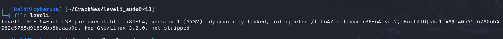
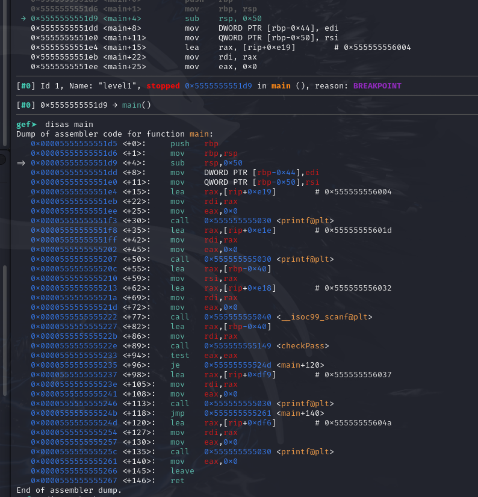
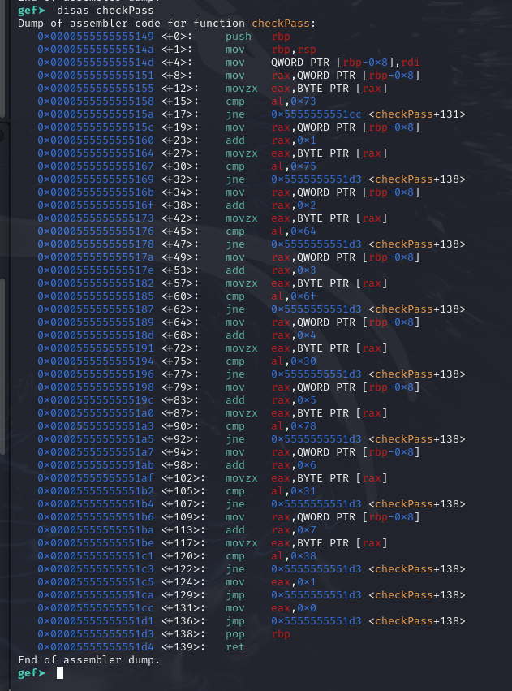
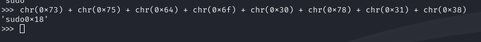
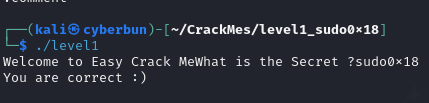
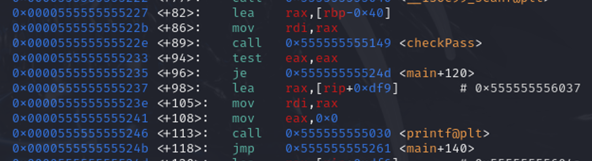

Starting of with the standard
`file`


`strings` had nothing noticeably interesting.

launching it in gdb/gef

let's start with the beginning :p

disassembly of main:



some normal `printf` calls, nothing all that interesting till `checkPass`, as well as it calling `scanf` for input right before that.. let's see what it holds.



My assembly isn't the most fluent (kinda why I am practicing these very easy crackmes... ) - but there was 1 thing that stood out to me quite fast, the `cmp al, 0x..` calls like at +15, +30, +45, etc.
Mainly because they're all (or almost all) letters in ascii.
Another thing I did not realize at the time was the `jne` calls.. look how only the very first one jumps to a different address ( `<+131>` ) - setting eax to 0 before returning.

So quickly typing those values into Python to see what letters they actually are we end up with:





**... But wait!**; as I was working on the writeup I finally realized the difference with the return address:
## How I understand it:

starting at `<+8>` in the `checkPass` function:
`MOV RAX, ..` loads a string or the address to a string (QWORD PTR - 8 bytes)
then
`MOVZX eax, rax` moves that into EAX as a BYTE PTR but because it goes from 8 to 1 byte(?) it only copies over the first character from the string? the rest gets padded with `0`'s so we'd have
`0x73 = 0b01110011 = 's'`

Thanks to [StackOverflow](https://stackoverflow.com/a/52892696)  for this - helping me visualize what's happening.

```
| 0000 0000 0000 0000 0000 0000 0111 0011 | ------> EAX

|                     0000 0000 0111 0011 | ------> AX

|                               0111 0011 | ------> AL ( = 's')

|                     0000 0000           | ------> AH
```

Then it does
`cmp al, 0x73` - to see if the letter matches the "hardcoded" characters e.g. `0x73` = `s`

the `add rax, 0x1` is just to increment the 'counter' to get the next character

rough C copy of what is happening

```c
int checkPass(char* pass) {
	if ((char) *pass != 0x73) { goto fail; } // 's'
	pass++; // Get the next character
	if ((char) *pass++ != 0x75) { goto end; }  // 'u'
	// etc.
	end:
	return 1;

	fail:
		return 0;
}
```

Because anything past the very first check of `!= 's'` leads right to `< +138 >` where we don't manually set the `eax` register to `0`; meaning, it still holds whatever the value of whatever our character is at the time (thanks to `movzx eax, BYTE PTR [rax]` ).

With this we return to our main function ( `<+94>` here)



we see that it does `test eax, eax`, and because we have a value in there that's not '0' and the following instruction `je` **only jumps if the ZF is SET to 1** we will simple step to the next instruction ( `<+98>` ).
which ends up with it printing the value of `0x555555556037: "You are correct :)"`

And that's everything we solved it, although I did feel a little misled and tricked haha :p
### How TEST works
[StackOverflow](https://stackoverflow.com/a/13065112)

```
TEST instruction performs a bitwise logical AND, discards the actual result and sets/unsets the ZF according to the result of the logical and: if the result is zero it sets ZF = 1, otherwise it sets ZF = 0.
```