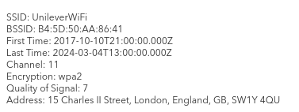

"What information can you possibly get with just one photo?"

Alright, let's start with this-

The Image we've been given:


First of, lets see if there's anything interest in its metadata with `exiftool`:


Interesting parts in here seem to be the GPS and copyright
```
GPS Latitude                    : 54 deg 17' 41.27" N
GPS Longitude                   : 2 deg 15' 1.33" W
Copyright                       : OWoodflint
```

## GPS Location
Coords: `54° 17' 41.27" N, 2° 15' 1.33" W`
Searching these in Google Maps puts us here.


## Copyright name:
`OWoodflint`

Googling it we end up with 3 links that look interesting (`-tryhackme` to try and avoid spoilers T_T )


## The BSSID
Using [Wigle](https://www.wigle.net/). with the BSSID: `B4:5D:50:AA:86:41`
We end up here (see the partial circle on London)


After zooming all the way in and clicking on it we get some more detailed network info;



## Their GitHub
At first glance, their GitHub profile ( https://github.com/OWoodfl1nt ) doesn't have anything visibly interesting, however their repository ( https://github.com/OWoodfl1nt/people_finder ) has some interesting info in the `README.md` mainly an email address and a link to a WordPress website!

With this we should have all our info except 1 thing, their password


After lots of scrolling around the source code of their website, I finally notice it, right under their post!
sneakily hidden text..


With this we solved all the questions and completed this room!