"A ctf for beginners, can you root me?"

Target IP: 10.10.1.26

-----------------
# Task 2
Lets take a look at the tasks:
```
Scan the machine, how many ports are open?

What version of Apache is running?

What service is running on port 22?

Find directories on the web server using the GoBuster tool.  

What is the hidden directory?
```

Okay, so let's start our basic recon
first off with a standard "aggressive" **NMAP** using: `nmap -A -T4 10.10.1.26`
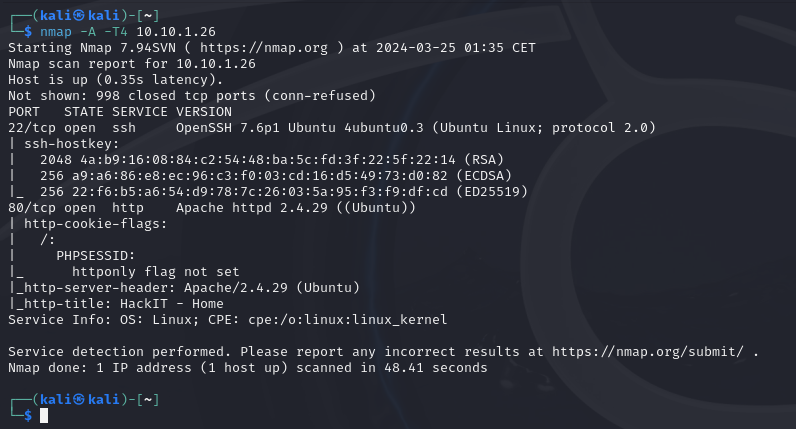
hmm this should already answer our first 3 questions:
We got 2 ports open, port 80 is running Apache/2.4.29 and port 22 is running an **SSH** service.

now we'll run a standard **gobuster** with a default wordlist in `dir` mode
`gobuster dir -u 10.10.1.26 -w /usr/share/wordlists/dirbuster/directory-list-1.0.txt`
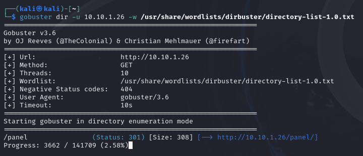
and we found something already, `/panel`

---
# Task 3
here they want to have us read a file on the target, so we'll need shell access.
we'll launch burpsuite and its attached browser to check out the URL we found earlier.

Attempting to upload a php shell didnt seem to work


Lets try some other file extensions first by adding the post request for this to the BurpSuite Intruder.
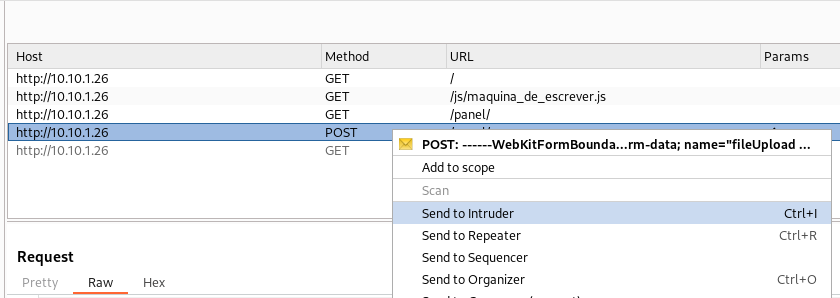

Here we set the filename extension as a variable
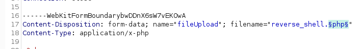
And for payloads we'll try some common php alternative extensions
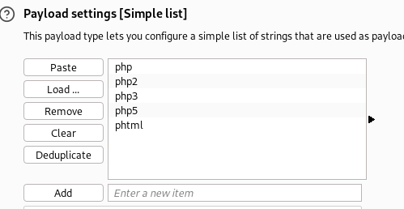

Results seem to say it was a success! and we can see the URL where it is available now!:
(I am certain there is a easier way to check success but still gotta learn a lot myself :p )
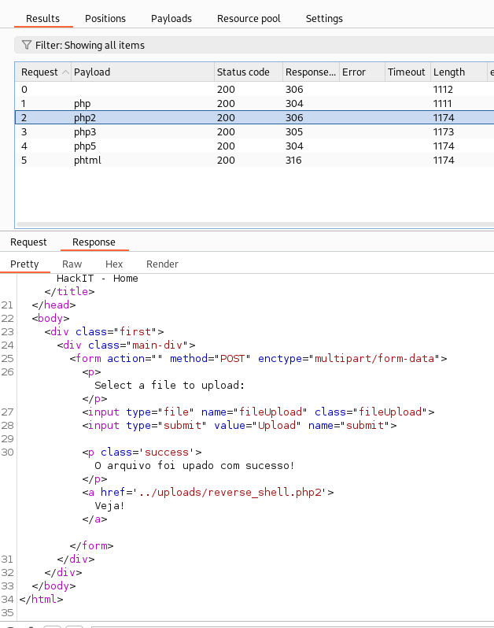

Before we open that we should set up our netcat to listen for connections
`nc -nlvp 1235`
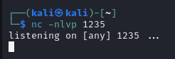

and after opening the file through the browser we got our shell!
(I had to use the `.phtml` to get a successful connection, the other ones despite being on the server would not execute the shell properly)
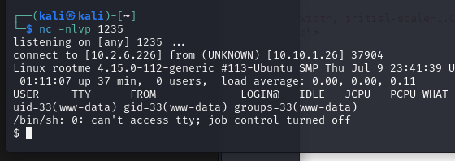

With our connection lets start looking for this file lazily
`file -name user.txt -print 2>/dev/null` 
( sidenote, the `2>/dev/null` is simply to hide all the "permission denied" files etc.)
and we found it in `/var/www/user.txt` !
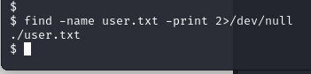
I wont show the flag here, but you can simply read it with `cat`

Next up we will try to escalate our shell by finding files with SUID perms:
`find / -user root -perm -4000 -exec ls -ldb {} \; 2>/dev/null`
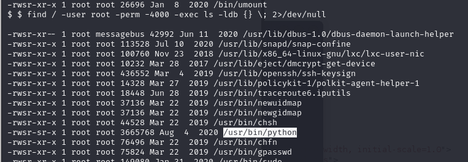
Python for sure stands out here..
Lets see what GTFOBins says about python with SUID 
( https://gtfobins.github.io/gtfobins/python/#suid )

We learn that we can run a shell and keep privileges by simply running 
`python -c 'import os; os.execl("/bin/sh", "sh", "-p")'`
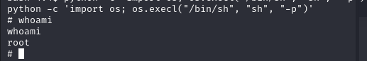
after this simply navigate to the root folder and get our final flag!