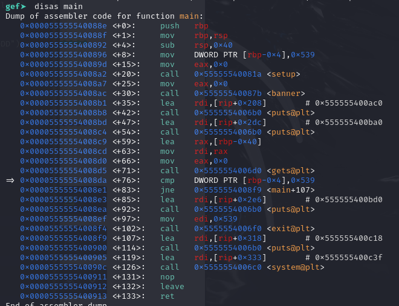
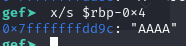
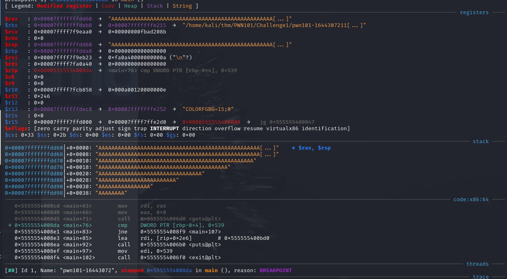
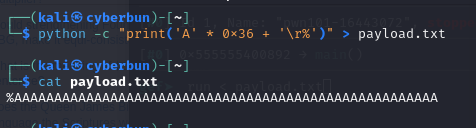
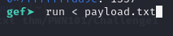
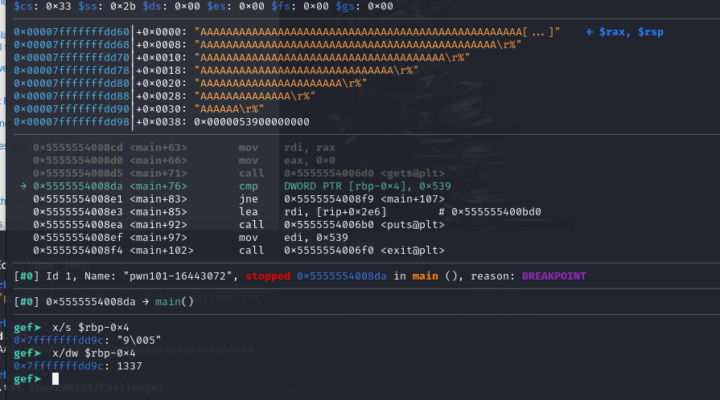

# Challenge 1
The hint suggests it's a simple buffer overflow, vulnerable call here would be the `gets` as usual.

Main code;



The register file is as follows: 

| **Register** | **Purpose**                                | **Saved across calls** |
| ------------ | ------------------------------------------ | ---------------------- |
| `%rax`       | temp register; return value                | No                     |
| `%rbx`       | callee-saved                               | Yes                    |
| `%rcx`       | used to pass 4th argument to functions     | No                     |
| `%rdx`       | used to pass 3rd argument to functions     | No                     |
| `%rsp`       | stack pointer                              | Yes                    |
| `%rbp`       | callee-saved; base pointer                 | Yes                    |
| `%rsi`       | used to pass 2nd argument to functions     | No                     |
| `%rdi`       | used to pass **1st argument to functions** | No                     |
| `%r8`        | used to pass 5th argument to functions     | No                     |
| `%r9v        | used to pass 6th argument to functions     | No                     |
| `%r10-r11`   | temporary                                  | No                     |
| `%r12-r15`   | callee-saved registers                     | Yes                    |

the gets() declaration: `char *gets(char *str)`

So we can see, at +59, we load the address `[rbp-0x40]` and this is then moved into `%rdi` the register to hold our first argument for functions.
After that eax to 0 and we jump to `gets` for our input
when we return it does a check if we have `0x539` or `1337` aka `\r%` in ascii characters and jumps or continues depending on that results, we don't want to jump here so we have to make sure it matches.

Assuming `0x40` is our approx. buffer size (64) lets see what an input of `64 * "A"` gets us in the stack.





Okay, so it seems like we ended up filling it with our buffer too!
I did not notice this at first but I guess we can just do `0x40 - 0x4` for our buffer and then the last 4 characters we try as `\r%` ?








```c
#include <stdio.h>
#include <stdlib.h>

void setup(){
    setvbuf(stdout,(char *)0x0,2,0);
    setvbuf(stderr,(char *)0x0,2,0);
    setvbuf(stdin,(char *)0x0,2,0);
}

void banner(){
    puts(
"       ┌┬┐┬─┐┬ ┬┬ ┬┌─┐┌─┐┬┌─┌┬┐┌─┐\n"
"        │ ├┬┘└┬┘├─┤├─┤│  ├┴┐│││├┤ \n"
"        ┴ ┴└─ ┴ ┴ ┴┴ ┴└─┘┴ ┴┴ ┴└─┘\n"
"                 pwn 101          \n"
    );
}

void main(){
    char inp[50];
    int is1337 = 1337;
    setup();
    banner();

    puts("Hello!, I am going to shopping.\n"
    "My mom told me to buy some ingredients.\n"
    "Ummm.. But I have low memory capacity, So I forgot most of them.\n"
    "Anyway, she is preparing Briyani for lunch, Can you help me to buy those items :D\n");
    puts("Type the required ingredients to make briyani: ");
    gets(inp);

    if (is1337 == 1337){
        puts("Nah bruh, you lied me :(\nShe did Tomato rice instead of briyani :/");
        exit(1337);
    }
    else{
        puts("Thanks, Here's a small gift for you <3");
        system("/bin/sh");
    }
}
```
